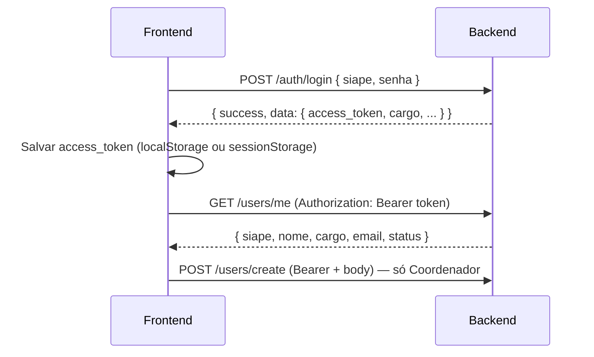

# Integração Frontend ↔ Backend — NAPNE Digital

Documento para o time de frontend: o que o backend oferece hoje, como consumir, e o que ainda falta para cobrir as telas do protótipo.

**Base URL (desenvolvimento):** `http://127.0.0.1:8000`  
**Documentação interativa:** `http://127.0.0.1:8000/docs` (Swagger)

---

## 1. Visão geral

| Camada | Situação atual |
|--------|----------------|
| **Backend** | FastAPI + SQLite + JWT. **4 endpoints ativos** (login, perfil, criar usuário, health check). |
| **Frontend** | Protótipo React com **dados mock** em memória. Sem `fetch`, sem token, sem `.env`. |
| **Integração** | Apenas **autenticação** e **cadastro de usuário (Corpo Docente)** podem ser ligados agora. Demais telas aguardam novos endpoints. |

O backend já modela no banco (via SQLAlchemy/Alembic) entidades como aluno, atendimento, reunião, ocorrência, responsável etc., mas **ainda não expõe APIs** para elas.

---

## 2. Configuração recomendada no frontend

### 2.1 Variável de ambiente

Copie `frontend/.env.example` para `frontend/.env.local` (não versionar):

```env
VITE_API_URL=http://127.0.0.1:8000
```

Uso:

```ts
const API_URL = import.meta.env.VITE_API_URL;
```

### 2.2 CORS (já configurado no backend)

O backend aceita requisições do browser nas origens padrão do Vite/React:

- `http://localhost:5173`
- `http://127.0.0.1:5173`
- `http://localhost:3000`
- `http://127.0.0.1:3000`

Se o frontend rodar em **outra porta**, peça ao backend para incluir a URL em `CORS_ORIGINS` no `.env` (não é necessário alterar código). Exemplo:

```env
CORS_ORIGINS=http://localhost:5173,http://localhost:5174
```

O frontend só precisa definir `VITE_API_URL` — ver `frontend/.env.example`.

### 2.3 Cliente HTTP sugerido

Estrutura mínima recomendada:

```
src/
  api/
    client.ts      # fetch wrapper + base URL
    auth.ts        # login, logout, getMe
    users.ts       # createUser (coordenador)
  context/
    AuthContext.tsx # token + usuário logado
```

---

## 3. Autenticação

### 3.1 Fluxo



### 3.2 Login — `POST /auth/login`

**Auth:** não requer token.

**Request** (`Content-Type: application/json`):

```json
{
  "siape": "1234567",
  "senha": "mudar123"
}
```

| Campo | Tipo | Regras |
|-------|------|--------|
| `siape` | `string` | exatamente 7 caracteres |
| `senha` | `string` | mínimo 8 caracteres |

**Resposta de sucesso** (HTTP `200`, envelope):

```json
{
  "success": true,
  "message": "Login realizado com sucesso",
  "data": {
    "usuario_id": 1,
    "siape": "1234567",
    "nome": "Coordenador SINAPNE",
    "cargo": "Coordenador",
    "access_token": "eyJhbGciOiJIUzI1NiIs...",
    "token_type": "bearer"
  }
}
```

**Resposta de erro de negócio** (HTTP ainda `200` — atenção!):

```json
{
  "success": false,
  "message": "Siape ou senha inválidos",
  "error_code": 404
}
```

**Validação Pydantic** (HTTP `422`):

```json
{
  "detail": [
    {
      "loc": ["body", "siape"],
      "msg": "String should have at least 7 characters",
      "type": "string_too_short"
    }
  ]
}
```

### 3.3 O que o frontend deve fazer no login

1. Trocar o mock em `App.tsx` por `POST /auth/login`.
2. Mapear campos do formulário:
   - Frontend usa `password` → enviar como **`senha`**
   - Frontend usa `name` → backend retorna **`nome`**
   - Frontend usa `role` → backend retorna **`cargo`**
3. Se `success === false`, exibir `message`.
4. Se `success === true`, guardar `data.access_token` e dados do usuário.
5. Redirecionar conforme `cargo`:
   - `"Coordenador"` → app coordenador (`coordenador.tsx`)
   - `"Professor"`, `"Psicólogo"`, `"Agente"` → app acompanhante (`acompanhantes.tsx`)

### 3.4 Mapeamento cargo (backend) ↔ role (frontend)

| Backend (`cargo`) | Tela no frontend |
|-------------------|------------------|
| `Coordenador` | `CoordenadorApp` |
| `Professor` | `AcompanhantesApp` |
| `Psicólogo` | `AcompanhantesApp` |
| `Agente` | `AcompanhantesApp` |

### 3.5 Credenciais de desenvolvimento

Criadas automaticamente na primeira subida do backend (se não existir Coordenador):

| Campo | Valor |
|-------|-------|
| SIAPE | `1234567` |
| Senha | `mudar123` |
| Cargo | `Coordenador` |
| E-mail | `coordenador@example.com` |

Substituem os usuários mock do `App.tsx` (ex.: SIAPE `8472910` / senha `admin` **não existem** no backend).

### 3.6 Token JWT

- Enviar em **todas** as rotas protegidas:
  ```http
  Authorization: Bearer <access_token>
  ```
- Expira em **60 minutos** (padrão atual).
- Payload contém apenas `sub` (id do usuário) e `exp`.
- Após expirar: `401` com `{ "detail": "Token expirado" }` → frontend deve deslogar e voltar ao login.

### 3.7 Onde guardar o token (“cache”)

Não há cookie HTTP-only hoje. Padrão simples:

```ts
// após login
localStorage.setItem("access_token", data.access_token);

// em cada requisição protegida
headers: {
  Authorization: `Bearer ${localStorage.getItem("access_token")}`,
}

// logout
localStorage.removeItem("access_token");
```

`sessionStorage` é alternativa se não quiser persistir entre abas/fechamento do browser.

---

## 4. Endpoints disponíveis

### 4.1 `GET /`

Health check. Sem auth.

```json
{ "message": "Hello, World!" }
```

---

### 4.2 `GET /users/me`

**Auth:** obrigatória (Bearer).

**Resposta** (HTTP `200`, JSON **sem envelope** — diferente do login):

```json
{
  "siape": "1234567",
  "nome": "Coordenador SINAPNE",
  "cargo": "Coordenador",
  "email": "coordenador@example.com",
  "status": "Ativo"
}
```

**Erros de auth** (HTTP real, formato `{ "detail": "..." }`):

| HTTP | `detail` |
|------|----------|
| `401` | `Token inválido`, `Token expirado` |
| `404` | `Usuário não encontrado` |

**Uso no frontend:**

- Validar sessão ao abrir o app (refresh da página).
- Preencher “Meu Perfil” com dados reais.
- Passar usuário logado para `CoordenadorApp` (hoje ele **não recebe** `loggedInUser`).

---

### 4.3 `POST /users/create`

**Auth:** Bearer + usuário com `cargo === "Coordenador"`.

**Request:**

```json
{
  "siape": "7654321",
  "nome": "Maria Silva",
  "cargo": "Professor",
  "email": "maria@example.com",
  "senha": "senha1234"
}
```

| Campo | Tipo | Regras |
|-------|------|--------|
| `siape` | `string` | 7 caracteres |
| `nome` | `string` | mín. 3 caracteres |
| `cargo` | `string` | ver valores válidos abaixo |
| `email` | `string` | e-mail válido |
| `senha` | `string` | mín. 8 caracteres |

**Valores válidos de `cargo`** (enum do backend):

- `Professor`
- `Psicólogo`
- `Agente`
- `Coordenador`

**Sucesso** (HTTP `200`, envelope):

```json
{
  "success": true,
  "message": "Usuário criado com sucesso",
  "data": {
    "siape": "7654321",
    "nome": "Maria Silva",
    "cargo": "Professor",
    "email": "maria@example.com",
    "status": "Ativo"
  }
}
```

**Erro de negócio** (HTTP `200`):

```json
{
  "success": false,
  "message": "Siape ou e-mail já cadastrado",
  "error_code": 400
}
```

**Erros de auth:**

| HTTP | `detail` |
|------|----------|
| `401` | Sem token / token inválido |
| `403` | `Usuário não autorizado` (não é Coordenador) |

**Ligação com a tela “Corpo Docente”** (`coordenador.tsx`):

O formulário de novo servidor deve chamar este endpoint. Mapeamento sugerido:

| Frontend (`StaffMember`) | Backend (`UserCreate`) |
|--------------------------|------------------------|
| `siape` | `siape` |
| `name` | `nome` |
| `role` | `cargo` (ajustar rótulos — ver tabela abaixo) |
| `email` | `email` |
| *(senha no form)* | `senha` — **hoje o mock não pede senha**; o backend exige |

| Rótulo no frontend | Enviar como `cargo` |
|--------------------|---------------------|
| Responsável | *(não existe no backend — usar `Agente` ou alinhar com backend)* |
| Psicólogo | `Psicólogo` |
| Agente | `Agente` |
| Coordenador SINAPNE | `Coordenador` |
| *(professor)* | `Professor` |

---

## 5. Dois formatos de resposta (importante!)

O backend usa **dois padrões diferentes**. O frontend precisa tratar ambos.

### 5.1 Envelope (login e criar usuário)

```ts
interface ApiEnvelope<T> {
  success: boolean;
  message: string;
  data?: T;
  error_code?: number;
}

// Sempre checar:
if (!response.success) {
  showError(response.message);
  return;
}
// usar response.data
```

**Atenção:** erros de negócio vêm com HTTP `200` e `success: false`. Não confiar só em `response.ok`.

### 5.2 JSON direto + HTTP status (`/users/me`, erros de auth)

```ts
// sucesso: objeto plano
{ siape, nome, cargo, email, status }

// erro:
{ detail: "Token expirado" }
```

### 5.3 Helper sugerido

```ts
async function api<T>(
  path: string,
  options: RequestInit = {},
  auth = true
): Promise<T> {
  const headers: Record<string, string> = {
    "Content-Type": "application/json",
    ...(options.headers as Record<string, string>),
  };

  if (auth) {
    const token = localStorage.getItem("access_token");
    if (token) headers.Authorization = `Bearer ${token}`;
  }

  const res = await fetch(`${import.meta.env.VITE_API_URL}${path}`, {
    ...options,
    headers,
  });

  const body = await res.json();

  // Rotas com envelope
  if ("success" in body) {
    if (!body.success) throw new Error(body.message);
    return body.data as T;
  }

  // HTTPException do FastAPI
  if (!res.ok) throw new Error(body.detail ?? res.statusText);
  return body as T;
}
```

---

## 6. O que cada tela do frontend pode fazer **hoje**

| Tela / feature | Pode integrar agora? | Endpoint(s) |
|----------------|----------------------|-------------|
| **Login** (`App.tsx`) | ✅ Sim | `POST /auth/login` |
| **Sessão / refresh** | ✅ Sim | `GET /users/me` |
| **Meu Perfil** | ⚠️ Parcial | `GET /users/me` (leitura). **Sem** endpoint de atualização. |
| **Corpo Docente** (criar servidor) | ✅ Sim | `POST /users/create` (Coordenador) |
| **Corpo Docente** (listar equipe) | ❌ Não | Sem `GET /users` |
| **Visão Geral (KPIs)** | ❌ Não | Sem agregações |
| **Alunos** (CRUD) | ❌ Não | Model existe, API não |
| **Atendimentos** | ❌ Não | Model `Atendimento` sem rota |
| **Reuniões** | ❌ Não | Model `Reuniao` sem rota |
| **Ocorrências** | ❌ Não | Model `Ocorrencia` sem rota |
| **PEI / Documentação** | ❌ Não | Model `Documentacao` sem rota |
| **Responsável** (cadastro no aluno) | ❌ Não | `responsavel_routes.py` comentado |
| **Histórico de turmas** | ❌ Não | Models `Turma`, `ProfessorTurma` sem rota |
| **Solicitações (prorrogação)** | ❌ Não | Model `Solicitacao` sem rota |

---

## 7. O que o frontend **deve** implementar (prioridade)

### Fase 1 — Autenticação (agora)

- [ ] `VITE_API_URL` no `.env`
- [ ] Serviço `login()` → guardar token + usuário
- [ ] Serviço `getMe()` → restaurar sessão ao recarregar a página
- [ ] Interceptor/header `Authorization` em rotas protegidas
- [ ] Tratar `success: false` (login) e `detail` (401/403)
- [ ] Mapear `cargo` → coordenador vs acompanhante
- [ ] Passar usuário logado para `CoordenadorApp` (como já faz com `AcompanhantesApp`)
- [ ] Logout limpando storage

### Fase 2 — Corpo Docente (agora)

- [ ] Formulário de novo membro com campo **senha** (mín. 8 caracteres)
- [ ] `POST /users/create` ao salvar
- [ ] Exibir erros (`Siape ou e-mail já cadastrado`)
- [ ] Listagem: aguardar `GET /users` do backend ou listar só os criados na sessão (workaround temporário)

### Fase 3 — Aguardar backend

Demais telas permanecem com mock até o backend expor APIs. Referência de domínio:

| Entidade backend | Tela frontend relacionada |
|------------------|---------------------------|
| `Aluno` | Alunos, ficha do aluno |
| `Atendimento` | Atendimentos, timeline |
| `Reuniao` | Reuniões |
| `Ocorrencia` | Ocorrências |
| `Documentacao` | PEI / documentação |
| `Responsavel` | Cadastro de responsável no aluno |
| `Solicitacao` | Pedidos de prorrogação |
| `Turma` / `ProfessorTurma` | Histórico de turmas |

---

## 8. Diferenças frontend ↔ backend (atenção na integração)

| Conceito | Frontend (mock) | Backend |
|----------|-----------------|---------|
| Senha | `password` | `senha` |
| Nome | `name` | `nome` |
| Papel | `role`: `coordenador` \| `acompanhante` | `cargo`: `Coordenador`, `Professor`, etc. |
| SIAPE | `string` no state | `string` de 7 chars na API |
| Senha mínima | `"admin"` (5 chars) aceito no mock | mínimo **8** caracteres |
| Persistência | Só React state | JWT + SQLite |
| `database.sql` (frontend) | Referência MySQL antiga | **Não é** o schema do backend |

---

## 9. Endpoints planejados (ainda não ativos)

Arquivo `backend/routes/responsavel_routes.py` — **comentado**, não registrado no `app.py`:

- `POST /responsaveis/create`
- `GET /responsaveis/`
- `GET /responsaveis/{id}`
- `PUT /responsaveis/{id}`
- `DELETE /responsaveis/{id}`

Não implementar consumo até o backend registrar e publicar contrato.

---

## 10. Checklist de teste manual (Swagger ou frontend)

1. `POST /auth/login` com `1234567` / `mudar123` → receber `access_token`
2. **Authorize** no Swagger com o token (ou header no fetch)
3. `GET /users/me` → dados do coordenador
4. `POST /users/create` **sem** token → `401 Not authenticated`
5. `POST /users/create` com token de Coordenador → criar Professor
6. `POST /users/create` com usuário não-Coordenador → `403`
7. Login com `success: false` → exibir mensagem, não guardar token

---

## 11. Contato / alinhamento

- Alterações de contrato (novos campos, novos endpoints) devem ser refletidas neste documento.
- Sugestão: versionar `frontend/docs/INTEGRACAO-BACKEND.md` junto com o código.
- Dúvidas sobre auth: `backend/core/dependencies.py`, `backend/services/auth_service.py`.
- Swagger local: subir o backend com `python app.py` na pasta `backend` (requer `.env` — ver `backend/.env.example`).

---

## O que fazer depois de ler este documento

Este é o passo a passo direto para o time de frontend começar a integração.

**1. Preparar o ambiente**

- Copie `frontend/.env.example` para `frontend/.env.local` e deixe `VITE_API_URL=http://127.0.0.1:8000`.
- Peça para alguém do backend subir a API (`python app.py` na pasta `backend`) ou suba você mesmo seguindo o `backend/.env.example`.
- Confirme que `http://127.0.0.1:8000/docs` abre no navegador.

**2. Trocar o login mock pelo login real**

- No `App.tsx`, pare de usar a lista `USERS` fixa.
- Chame `POST /auth/login` enviando `siape` e `senha` (não `password`).
- Se `success` for `true`, guarde o `access_token` no `localStorage` (ou `sessionStorage`).
- Use o `cargo` da resposta para decidir qual app abrir: `Coordenador` → coordenador; `Professor`, `Psicólogo` ou `Agente` → acompanhante.
- Se `success` for `false`, mostre a `message` para o usuário.

**3. Manter o usuário logado ao recarregar a página**

- Ao abrir o app, se existir token salvo, chame `GET /users/me` com o header `Authorization: Bearer <token>`.
- Se der certo, restaure a sessão. Se der `401`, apague o token e volte para a tela de login.

**4. Enviar o token em rotas protegidas**

- Toda requisição que precisa de login deve incluir `Authorization: Bearer <token>`.
- Crie um cliente HTTP central (`api/client.ts` ou similar) para não repetir isso em cada tela.

**5. Integrar a tela “Corpo Docente” (só coordenador)**

- Ao cadastrar um servidor, chame `POST /users/create`.
- Envie `siape`, `nome`, `cargo`, `email` e `senha` (mínimo 8 caracteres).
- Trate erros com `success: false` (ex.: siape ou e-mail já cadastrado).
- A listagem completa da equipe ainda não existe no backend — por enquanto só o cadastro funciona de verdade.

**6. Deixar o resto como mock por enquanto**

- Alunos, atendimentos, reuniões, ocorrências, PEI e dashboard **ainda não têm API**.
- Não tente integrar essas telas agora; continue com os dados locais até o backend liberar novos endpoints.

**7. Lembrete importante sobre respostas**

- Login e criar usuário usam o formato `{ success, message, data }` — sempre verifique `success`.
- `/users/me` e erros de token usam HTTP `401`/`403` com `{ detail }` — trate os dois formatos.

**Em resumo:** configure a URL da API, implemente login + sessão + token nas requisições, conecte o cadastro de usuários do coordenador e mantenha as outras telas no mock até novas rotas ficarem prontas. O backend já está com CORS configurado; o frontend não precisa alterar o backend para começar.
